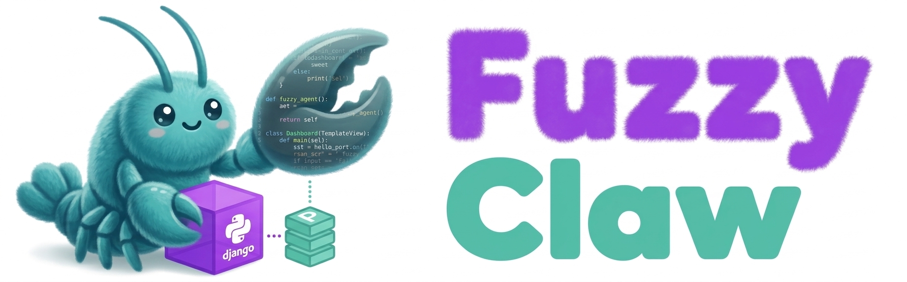
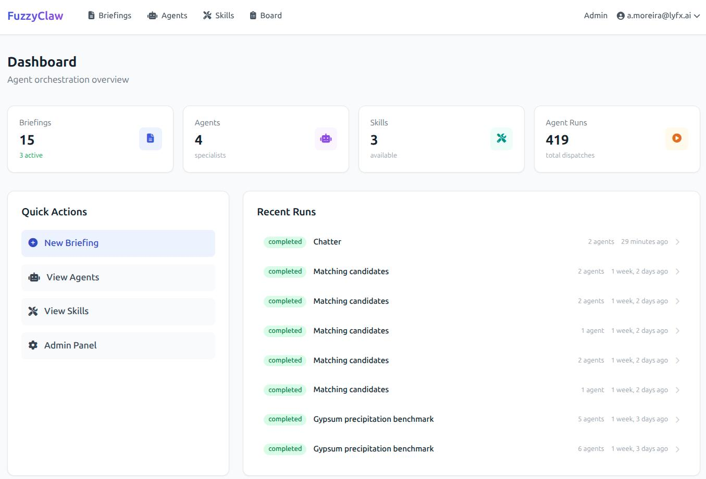
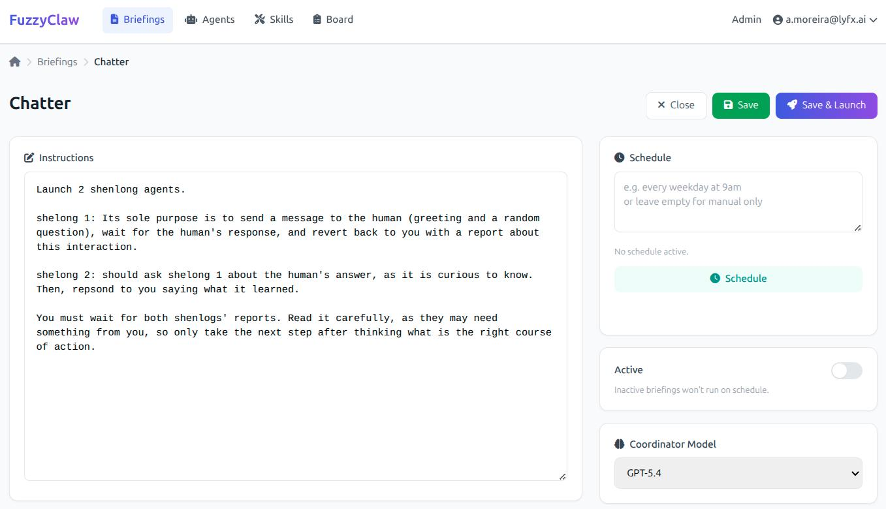
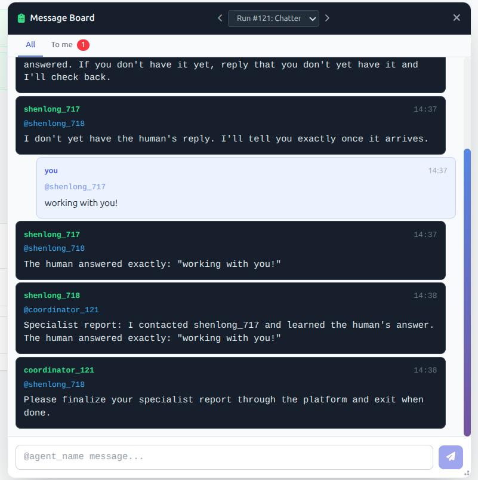
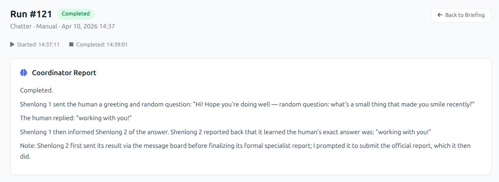

<p align="center">
  
</p>

# FuzzyClaw

**Multi-agent orchestration for people who want a real control center, not just a chat box.**

FuzzyClaw is a Python-first agent framework built with **Django**, **PostgreSQL**, and **Docker**. It lets you run a coordinator plus isolated specialist agents, manage structured briefings, track runs, schedule recurring work, and keep humans in the loop through a shared message board.

Unlike node-based workflow tools, FuzzyClaw is built around **autonomous tool-using agents** that run inside their own containers with their own model, tools, memory, and volume access. It combines that agent runtime with a persistent Django dashboard and structured operational state in PostgreSQL.

FuzzyClaw uses LangChain's [**Deep Agents**](https://github.com/langchain-ai/deep-agents), so model choice is not tied to a single provider. Different agents can use different models depending on cost, speed, or task complexity.

It is heavily inspired by [**OpenClaw**](https://github.com/openclaw/openclaw) and [**nanoclaw**](https://github.com/qwibitai/nanoclaw), especially the emphasis on delegation, optionality, and agent isolation — but rebuilt around a Django-native workflow that feels at home in Python-heavy projects.

<p align="center">
  
</p>

## Why FuzzyClaw?

- **Coordinator + specialists** — one agent delegates, specialists execute
- **Docker-isolated specialists** — agents run in containers, not loose on your machine
- **Always-on assistant** — Fuzzy, the platform assistant, is available 24/7 on the message board
- **Human-in-the-loop** — talk to agents while a run is still happening
- **Persistent by design** — briefings, reports, history, search, and scheduling live in PostgreSQL
- **Django-native** — auth, admin, dashboards, file manager, and workflows included
- **Model-flexible** — use the model that fits each agent

## Philosophy

FuzzyClaw is built around three ideas: **delegation**, **isolation**, and **operational clarity**.

- The **coordinator** reads the briefing, breaks work into steps, and delegates. It does not use execution tools directly.
- The **specialists** do the actual work. Each runs in its own Docker container with only the tools and filesystem access it needs.
- **Shenlong** is the fallback generalist. When no specialist is a good fit, the coordinator can call Shenlong.
- The **Message Board** is the shared communication layer for each run, so agents, coordinator, and human can coordinate in real time.
- **Skills** are shared capabilities under `skills/` that all agents can use when relevant.
- **Fuzzy** is the always-on platform assistant. It starts with `docker compose up` and lives on the message board permanently. It can query briefings, runs, and reports, search the web, use skills, and remember user preferences across conversations. It's not a coordinator — it doesn't dispatch agents — but it knows everything that's happening on the platform.

Django handles everything user-facing: authentication, dashboards, the briefing editor, run history, file manager, admin, and scheduling. The frontend is server-rendered HTML with [**HTMX**](https://htmx.org/) where it makes sense.

The result is a system that feels less like an agent demo and more like an operational workspace for running real agent workflows.

## How It Works

```
User writes a Briefing (markdown)
    |
    v
Coordinator Agent (strong model, runs in Celery worker)
    |-- reads briefing steps
    |-- lists available specialist agents
    |-- dispatches specialists by name
    |-- communicates via Message Board (Redis Streams)
    |
    +---> Specialist Container 1
    |         |-- follows instructions
    |         |-- follows skills from /app/skills/
    |         |-- writes report.json to shared volume
    |         \-- exits when done (coordinator waits)
    |
    +---> Specialist Container 2
    |         \-- (same pattern as Specialist 1)
    |
    +----< Message Board (Redis Streams) >----+
    |         |-- human, coordinator, and agents exchange messages
    |         |-- floating panel on dashboard with @mentions
    |         \-- polling every 3s, autocomplete for participants
    |
    v
Coordinator synthesizes reports -> Run.coordinator_report
    |
    v
Dashboard shows results + message history

Fuzzy (always-on assistant, separate Docker Compose service)
    |-- listens on permanent board stream
    |-- queries platform state (briefings, runs, reports) via REST API
    |-- has persistent memory, web access, skills
    |-- conversational memory with living summary
    \-- one instance serves all users (scoped by user_id)
```

<p align="center">
  <br>
  <em>Writing a briefing — the coordinator reads this and dispatches agents</em>
</p>

<p align="center">
  <br>
  <em>Message Board — human, coordinator, and agents communicate during a run</em>
</p>

<p align="center">
  <br>
  <em>Run results — coordinator synthesis + individual agent reports</em>
</p>

### Agents

Markdown files in `agents/`. YAML frontmatter defines the model, tools, memory, and optional volume mounts. The body is the system prompt.

```yaml
---
name: shenlong
description: General-purpose agent for any task.
model: gpt-5.4
tools: ["web_search", "web_scrape", "bash", "message_board"]
memory: true
volumes:
  - scope: "user"
    mount: "/app/data"
    mode: "rw"
---
You are Shenlong, a general-purpose agent...
```

Drop a `.md` file in `agents/`, run `sync_images`, and it's live. Each agent gets its own Docker image — a thin layer on top of a shared base image — so every specialist runs in an isolated container with only what it needs.

### Skills

Directories in `skills/` with a `SKILL.md` file and optional sub-folders, following the [Agent Skills specification](https://agentskills.io/home). Every agent sees every skill and decides which to use based on its task.

### Tools

Python functions in `agent_tools/`. Currently ships with:

| Tool                                 | What it does         | Notes                                                                                                  |
| ------------------------------------ | -------------------- | ------------------------------------------------------------------------------------------------------ |
| `bash`                               | Shell execution      | Only grant to models you trust                                                                         |
| `web_search`                         | Google search        | Via [ScrapingBee](https://www.scrapingbee.com/) SERP API (swap for your preferred provider)            |
| `web_scrape`                         | Page scraping        | ScrapingBee + HTML cleaning (swap-friendly)                                                            |
| `career_scrape`                      | Job listing scraper  | Domain-specific selectors for EN/DE job pages. Literally done for a friend, could be useful to many... |
| `remember` / `recall` / `recall_all` | Persistent memory    | PostgresStore, scoped per user + agent + briefing                                                      |
| `message_board`                      | Real-time messaging  | `post_message`, `read_messages`, `list_participants` — Redis Streams, with notification middleware     |
| `platform_query`                     | Platform state query | Fuzzy's tools: list/get briefings, runs, agent reports via REST API                                    |

The scraping tools use ScrapingBee because that's what we use. Swapping to Browserless, Playwright, or raw requests is straightforward; each tool is a single Python file.

### Scheduling

Write a natural language schedule in the briefing ("every weekday at 9am", "twice a month on the 1st and 15th at noon EST"). Click Schedule. A cheap LLM call parses it into a cron expression. Celery Beat fires the briefing automatically.

No cron jobs on the host — everything goes through `django-celery-beat`, visible and editable from the Django admin. Some will find this a limitation, but it's a matter of taste. I want to see in the admin panel what is scheduled and what is not. The coordinator can also manage schedules programmatically via its `manage_schedule` tool — so your briefings can adapt their own frequency based on what the agents find.

### File Manager & Volume Scoping

Agents run in isolated containers, but they often need to produce or read files. The `volumes` field in agent frontmatter uses scoped mounts:

- **`scope: "user"`** — mounts `data/users/{owner_id}/` into the container. Private per user. Accessible from the dashboard's File Manager (`/files/`).
- **`scope: "run"`** — mounts `data/runs/run_{run_id}/` for cross-agent file sharing within a single run. Cleaned up after.

The **File Manager** in the dashboard lets users browse, upload, download, rename, move, and delete files in their personal data directory — the same directory their agents read from and write to.

Agent memory is scoped to `(owner_id, agent_name, briefing_id)`, so the same agent running for different briefings keeps separate memories.

## Tech Stack

| Layer               | Technology                                                                                                         |
| ------------------- | ------------------------------------------------------------------------------------------------------------------ |
| Web / Auth / ORM    | Django 5.1 + PostgreSQL                                                                                            |
| Frontend            | HTMX 2.0 + Tailwind CSS + Alpine.js (server-rendered, no build step)                                               |
| Agent framework     | [Deep Agents](https://github.com/langchain-ai/deep-agents) (LangChain / LangGraph)                                 |
| LLM providers       | OpenAI (GPT-5, GPT-5-mini), Google (Gemini 2.5 Pro/Flash), Anthropic (Claude Opus/Sonnet) — configurable per agent |
| Container isolation | Docker (one container per specialist agent)                                                                        |
| Task scheduling     | Celery + Celery Beat + Redis (not cron)                                                                            |
| Persistent memory   | PostgresStore (LangGraph checkpoint store)                                                                         |
| Deployment          | Docker Compose                                                                                                     |

## Requirements

- **Linux or macOS** (Windows might work via WSL2, but untested)
- **Docker** with the Compose plugin
- **Python 3.11+** (for local development/tests only — production runs entirely in Docker)
- At least one LLM API key: OpenAI, Google, or Anthropic

Everything else (PostgreSQL, Redis, Celery, the web server) runs inside Docker. You don't need to install any of it.

## Quick Start

```bash
# Clone and configure
git clone https://github.com/andremoreira73/fuzzyclaw.git
cd fuzzyclaw
cp .env.example .env        # edit this — add your API keys and set DB credentials
```

> **Important:** Edit `.env` before proceeding. You need at least `DB_PASSWORD`, `DJANGO_SECRET_KEY`, and one LLM API key (`OPENAI_API_KEY`, `GOOGLE_API_KEY`, or `ANTHROPIC_API_KEY`). ScrapingBee and LangSmith keys are optional — see comments in `.env.example`.

```bash
# Check your Docker socket GID and set it in .env
stat -c '%g' /var/run/docker.sock   # → set DOCKER_GID in .env to this value
```

> **Why?** The `web` and `celery` containers need to talk to the Docker socket to launch agent containers. The socket is group-owned by a GID that varies by distro (983 on Arch, 999 on Ubuntu, 974 on Fedora, etc.). `DOCKER_GID` in `.env` tells the containers which group to join. If it doesn't match, agent launches will fail with a permission error. macOS Docker Desktop handles this automatically.

```bash
# Start the platform (PostgreSQL, Redis, web, Celery, Celery Beat)
docker compose up -d

# Build agent Docker images
docker compose exec web python manage.py sync_images

# Create your admin user
docker compose exec web python manage.py createsuperuser

# Set up Fuzzy (the always-on assistant)
# Create an API token: Admin > Auth Token > Tokens > Add (pick your user)
# Add to .env: FUZZYCLAW_FUZZY_API_TOKEN=<your-token>
# Then restart: docker compose up -d fuzzy

# Open the dashboard
open http://localhost:8200
```

See [`examples/briefings/`](examples/briefings/) for sample briefings — from single-agent tasks to multi-agent parallel orchestration. Copy one into the briefing editor to try it out.

### Using Claude Code

If you have [Claude Code](https://claude.ai/download) installed, you can just:

```bash
cd fuzzyclaw
claude
```

Then say "set this up". The `CLAUDE.md` file has step-by-step instructions that Claude Code will follow.

### After editing agents

```bash
# Rebuild images and restart workers
./sync_agents.sh
```

### Running tests

```bash
source venv/bin/activate
DATABASE_URL=sqlite:///test.db python manage.py test core
```

## Project Structure

```
fuzzyclaw/
├── agents/                  # Agent definitions (*.md) — drop a file, it's live
│   ├── fuzzy.md             # Always-on platform assistant
│   ├── shenlong.md          # General-purpose agent (the divine dragon)
│   ├── market-researcher.md # Web research specialist
│   ├── career-scraper.md    # Job listing scraper
│   └── web-scraper.md       # Page content extractor
├── skills/                  # Skill definitions (*/SKILL.md) — all agents see all skills
│   └── market-research/
│       └── SKILL.md
├── agent_tools/             # Python tools baked into agent containers
│   ├── message_board.py     # Board tools + setup_message_board() entry point
│   ├── board_middleware.py  # BoardNotificationMiddleware (before_model)
│   └── platform_query.py   # REST API query tools (fuzzy's platform awareness)
├── agent_runner.py          # Container entrypoint for specialist agents
├── fuzzy_runner.py          # Container entrypoint for fuzzy (idle loop + conversation history)
├── core/                    # Django app: models, views, API, scheduling, containers
├── templates/               # Django templates with HTMX
├── data/                    # User and run data (scoped volumes, file manager)
├── docker-compose.yml       # Platform services (db, redis, web, celery, celery-beat, fuzzy)
├── Dockerfile.agent         # Base image for specialist agent containers
├── Dockerfile.fuzzy         # Image for the fuzzy assistant container
└── design_notes.md          # Architecture decisions and rationale
```

## FAQ

**Why Django?**

It comes with batteries included (auth, admin, ORM, migrations, sessions), and it's been rock-solid in production for almost 20 years. Django provides a real admin panel where one can see everything that's going on.

**Why PostgreSQL instead of SQLite?**

Concurrency. Celery workers, agent containers, and the web server all hit the database at the same time. SQLite locks on writes. PostgreSQL handles concurrent access natively. It's also where agent memory lives (via LangGraph's PostgresStore), so everything is in one place.

**Why Celery Beat instead of cron?**

Visibility. Cron jobs are invisible — they live in a crontab file somewhere and you find out they're broken when things stop happening. Celery Beat schedules live in the database, visible in the Django admin. You can see what's scheduled, when it last ran, enable/disable from the UI. Plus, schedules are created programmatically (from natural language via LLM), not by editing system files.

**Can I use models other than OpenAI/Google/Anthropic?**

Yes. FuzzyClaw uses LangChain under the hood, so any model with a LangChain integration works. Add the provider package to requirements, register the model in `FUZZYCLAW_MODELS` in settings, and it's available. Each agent can use a different model — cheap models for simple tasks, strong models for complex ones.

**Is this secure?**

We take isolation seriously — each specialist runs in its own Docker container with only the tools and API keys it needs, no Docker socket access, and resource limits enforced. Our red-team tests (see Security section above) showed that both the coordinator and agent LLMs refused to attempt container escapes, and the container boundary held even if they had tried.

That said: no system is perfectly secure. The `bash` tool inside a container is powerful. Volume mounts expose real host directories. LLM behavior can be unpredictable. Review your agent definitions, be thoughtful about what you mount, and treat this as defense in depth, not a guarantee.

**Why not TypeScript / Why not nanoclaw?**

nanoclaw is excellent and inspired FuzzyClaw directly — especially the container-per-agent philosophy. But nanoclaw is built around Claude Code and the Anthropic API. I wanted multi-provider LLM support (OpenAI, Google, Anthropic), a persistent dashboard with run history, and Django's ecosystem. Different tools for different preferences.

## Roadmap

Things I want to add when time allows:

- **Cross-board @fuzzy** — wake fuzzy from within any run board, not just its own stream
- **WhatsApp channel** — notifications and commands via WhatsApp (the infra is ready, just needs wiring)
- **Stop button** — cancel a running run from the UI
- **Memory TTL** — auto-expire stale agent memories (PostgresStore already supports `ttl_minutes`)
- **More tools** — email reading, document parsing, code execution sandboxes
- **Better dashboard** — run comparisons, trend charts, search across reports

Recently shipped:
- **Fuzzy** — always-on platform assistant with conversational memory and platform awareness
- **File Manager** — browse, upload, and manage agent data files from the dashboard
- **Briefing-scoped memories** — agents remember per briefing, not globally
- **Multi-user fuzzy** — one container, per-user memory and conversation isolation

## Contributing

PRs are welcome! But bear in mind that this is a personal project. Claude is obviously part of our team, but we have limits.

A few guidelines:

- **Open an issue first** for anything non-trivial, so we can discuss before you code.
- **Keep it simple.** FuzzyClaw is deliberately not over-engineered. If something can be a single Python file, it should be.
- **Django conventions.** If Django has a way to do it, use that way.
- **Test your changes.** `DATABASE_URL=sqlite:///test.db python manage.py test core` should pass.
- **New tools** are the easiest contribution — each one is a standalone Python file in `agent_tools/`.

## License

MIT
